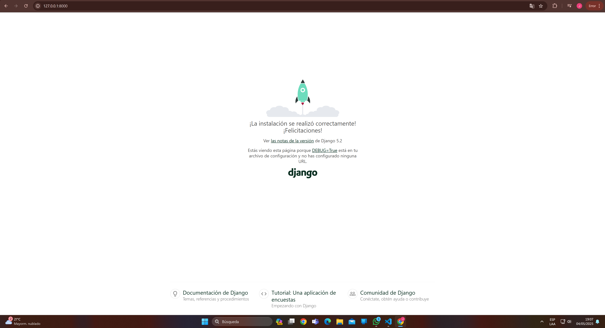
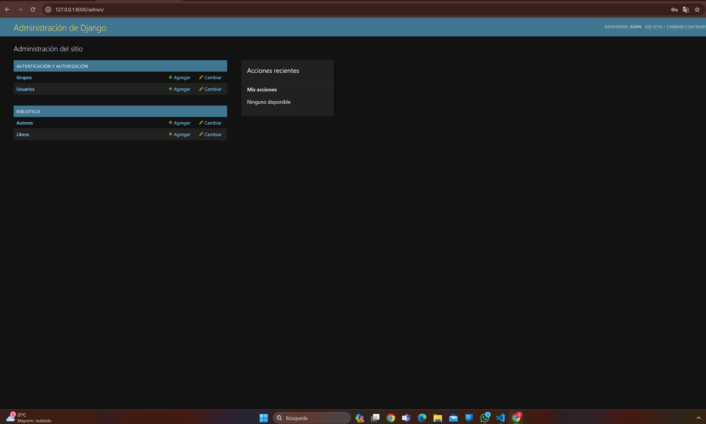
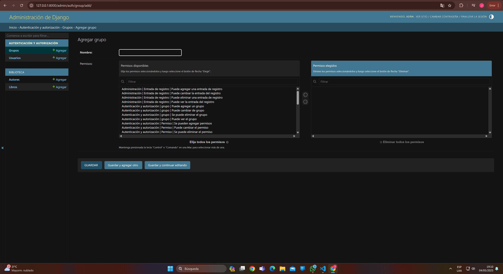
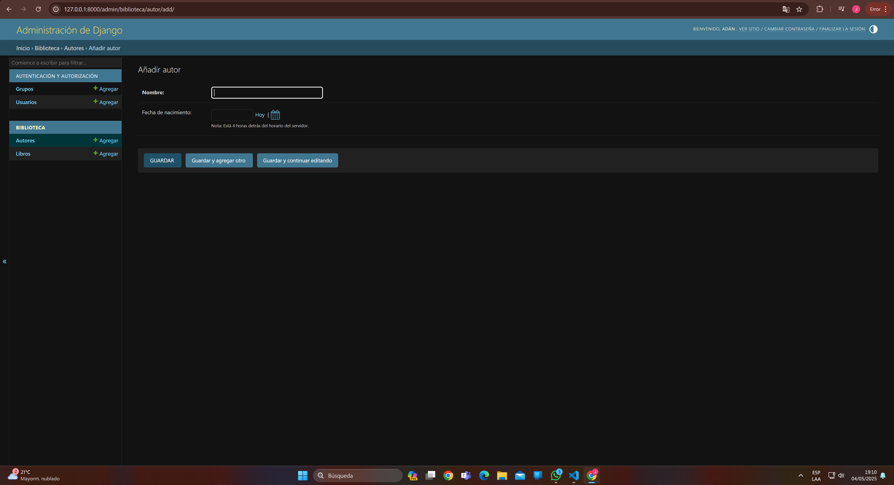

# Práctica 2 - E-TEK

*Desarrollo de software con reutilización de código de terceros en gestores de paquetes*

---

## Objetivo

Desarrollar la capacidad de reutilizar herramientas de código de terceros mediante la configuración de entornos de desarrollo aislados y la instalación de herramientas utilizando el gestor de paquetes de Python (pip).

---

## 1. Creación y clonación del repositorio

- Se creó un repositorio público en GitHub: [https://github.com/AdanCR1/PG2_Practica2](https://github.com/AdanCR1/PG2_Practica2)
- Se clonó el repositorio:
```bash
    git clone https://github.com/AdanCR1/PG2_Practica2.git
    cd PG2_Practica2
```

---

- Creación del entorno virtual:
```bash
    python -m venv venv
    source venv/bin/activate  # En Windows: venv\Scripts\activate
```
- Se creó el archivo .gitignore para ignorar el entorno virtual y otros archivos innecesarios:
```bash
    echo "venv/" >> .gitignore
    echo "__pycache__/" >> .gitignore
```

## 2. Instalación de dependencias
- Se agregó Django al archivo requirements.txt:
```bash
    echo "Django==4.2.3" >> requirements.txt
```
- Instalación de dependencias:
```bash
    pip install -r requirements.txt
```

## 3. Creación del proyecto Django
- Se inicializó un nuevo proyecto Django llamado "PROYECTO_WEB":
```bash
    django-admin startproject PROYECTO_WEB
```
- Se creó la app biblioteca:
```bash
    cd PROYECTO_WEB
    python manage.py startapp biblioteca
```
- Se registró la app en el archivo settings.py:
```python
    INSTALLED_APPS = [
        'biblioteca',
        # Otras apps
    ]
```
-Se crearon los modelos en biblioteca/models.py:
```python
    from django.db import models

# Create your models here.
    from django.db import models
    # Create your models here.
    from django.db import models
    class Autor(models.Model):
        nombre = models.CharField(max_length=100)
        fecha_nacimiento = models.DateField(null=True, blank=True)

        def _str_(self):
            return self.nombre
    
    class Libro(models.Model):
        titulo = models.CharField(max_length=200)
        autor = models.ForeignKey(Autor, on_delete=models.CASCADE)
        fecha_publicacion = models.DateField()

        def _str_(self):
            return self.titulo
```
- Se iniciaron y aplicaron las migraciones:
```bash
    python manage.py makemigrations
    python manage.py migrate
```
- Se configuró el panel de adminnistración:
```python
    from models import Autor, Libro

    admin.site.register(Autor)
    admin.site.register(Libro)
```
- Se debe crear un superusuario para acceder al panel de administración:
```bash
    python manage.py createsuperuser
```

- Se debe crear un superusuario para acceder al panel de administración:
```bash
    python manage.py createsuperuser
```

- Se inicia el servidor de desarrollo:
```bash
    python manage.py runserver
```

- Estructura del proyecto:
```bash
    PROYECTO_WEB/
    ├── biblioteca/
    │   ├── migrations/
    │   ├── __init__.py
    │   ├── admin.py
    │   ├── apps.py
    │   ├── models.py
    │   ├── tests.py
    │   └── views.py
    ├── PROYECTO_WEB/
    │   ├── __init__.py
    │   ├── asgi.py
    │   ├── settings.py
    │   ├── urls.py
    │   └── wsgi.py
    ├── manage.py
    └── requirements.txt
```

## 4. Capturas del Panel de administración

- Acceder al panel de administración en [http://localhost:8000/admin](http://localhost:8000/admin)

---



---



---



---

